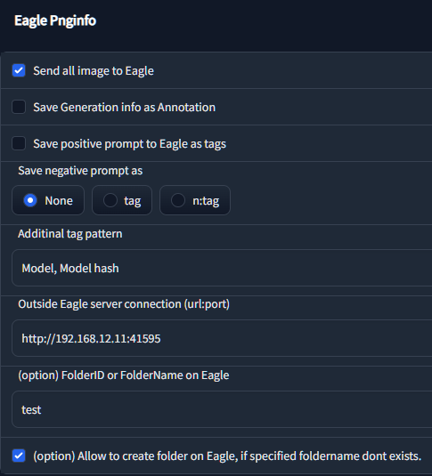
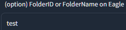
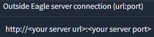

# Eagle-pnginfo


[English README](README.md)

- [AUTOMATIC1111's Stable Diffusion Web UI](https://github.com/AUTOMATIC1111/stable-diffusion-webui) 用の Extension です
- WebUIで生成した画像を、生成情報(プロンプト・Generation Info)を含めて、お手元の PC で動いている [Eagle](https://jp.eagle.cool/) (画像管理ソフト) へ転送・登録します

## インストール方法

- `Extensions` タブを開く

- `Install from URL` にこのレポジトリの URL を入力

- `Install` を実行

- 別途、PCへ [Eagle]([https://jp.eagle.cool/](https://jp.eagle.cool/) をインストールしておく

## 使い方 / How to use

- "設定" タブで、この Extension を有効にする

- 別途、"Eagle" アプリを立ち上げておく

- "AUTO1111" の Web UI を開き、いつも通り画像を生成する
  
   - 生成された画像は、自動的に Eagle アプリに登録されます

## 設定項目について

| In "Setting" tab                                                     |                                                                                                                                                                                                                                                                                                             |
| -------------------------------------------------------------------- | ------------------------------------------------------------------------------------------------------------------------------------------------------------------------------------------------------------------------------------------------------------------------------------------------------------------------------ |
| Send all image to Eagle                                              | この Extension を有効にします                                                                                                                                                                                                                                                                                                           |
| Save Generation info as Annotation                                   | PNGinfo に表示されるような、3行からなる生成情報を、Eagle の メモ欄に登録します                                                                                                                                                                                                                                                                                |
| Save positive prompt to Eagle as tags                                | プロンプトを Eagle の tag として登録します                                                                                                                                                                                                                                                                                                    |
| Save negative prompt to Eagle as                                     | ネガティブプロンプトを Eagle の tag として登録します<br/>None: 登録しません<br/>tag: 登録します<br/>n:tag 登録します。登録時、タグ名の頭に "n:" をつけ、通常のプロンプトの tag と判別できるようにします                                                                                                                                                                                                |
| Additinal tag pattern                                                | Generation info の3行目に表示されている項目について、タグ化する項目を選択できます<br/><br />使用可能な設定は以下の通りです。<br/>```Steps,Sampler,CFG scale,Seed,Face restoration,Size,Model hash,Model,Hypernet,Hypernet strength,Variation seed,Variation seed strength,Seed resize from,Denoising strength,Conditional mask weight,Eta,Clip skip,ENSD``` |
| Outside Eagle server connection (url:port)                           | URL:Portを用いて、公開されている Eagle サーバへ画像を送信する設定です                                                                                                                                                                                                                                                                                     |
| FolderID or FolderName on Eagle (option)                             | Eagle 上での画像保存先フォルダを、FolderID または Folder名で設定できます                                                                                                                                                                                                                                                                                |
| Allow to crete folder on Eagle, if specified foldername dont exists. | (option) 指定された名前のフォルダが存在しない場合に、新しくその名前のフォルダを作成することを許可する設定です                                                                                                                                                                                                                                                                    |

## 設定サンプル

| Settings              | Result                | Comment                                                                                             |
| --------------------- | --------------------- | --------------------------------------------------------------------------------------------------- |
|    | No output to Eagle    |                                                                                                     |
|  |  | 画像を Eagle へ送ります                                                                                     |
|  |  | 画像を Eagle へ送ります<br/>Generation info 付き                                                              |
|  |  | 画像を Eagle へ送ります<br/>Generation info, tag, positive prompt 付き                                        |
|  |  | 画像を Eagle へ送ります<br/>Generation info, tag, negative prompt 付き                                        |
|  |  | 画像を Eagle へ送ります<br/>Generation info, tag, negative prompt 付き。< i.e.) n:bad anatomy                  |
|  |  | 画像を Eagle へ送ります<br/>Generation info, tag, positive prompt, negative prompt 付き。< i.e.) n:bad anatomy |

### 設定サンプル: フォルダへの保存（IDで指定）

| Settings              | Result                | Comment                                                                   |
| --------------------- | --------------------- | ------------------------------------------------------------------------- |
|  |                       | folderID を入れておくと、対象のフォルダに画像が格納されます                                        |
|  |  | "Eagle forlderID" を取得するには、Eagle UI で対象のフォルダを右クリックし、"リンクをコピー" を選択          |
|  |                       | folderID の悪い例<br/>コピーしたものをそのまま入力すると左画像のように長いパス名が入っていますが、必要になるのは右端の文字列のみです |

### 設定サンプル: フォルダへの保存（フォルダ名で指定）



- 画像を保存したいフォルダ名を入力してください
- 上記のサンプルでは `eagle_inbox` を指定しています

### 設定サンプル: ネットワーク越しで Eagle Server へ保存



- Eagle サーバへアクセス出来るようにする必要があります
- サーバアドレスを以下の形式で入力してください ```http://<server_ip>:<port>```
- 使用しない場合は、空白にしてください
