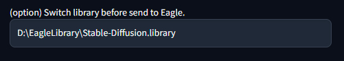

# Eagle-pnginfo


[日本語 README はこちら](README.ja.md)

- This is Extension for [AUTOMATIC1111's Stable Diffusion Web UI](https://github.com/AUTOMATIC1111/stable-diffusion-webui)
- Send your creation image to [Eagle](https://jp.eagle.cool/) (image management software) with Generation info, tags.

## How to Install

- Go to `Extensions` tab on your web UI

- `Install from URL` with this repo URL

- Install

- Install [Eagle]([https://jp.eagle.cool/](https://jp.eagle.cool/))

## How to use

- Enable this extension in "Setting"

- Start "Eagle" application

- Open "AUTO1111" and create image as usual.

   - images sent to "Eagle" automatically

## About Setting params

| In "Setting" tab                                                     |                                                                                                                                                                                                                                                                                                        |
| -------------------------------------------------------------------- | ------------------------------------------------------------------------------------------------------------------------------------------------------------------------------------------------------------------------------------------------------------------------------------------------------------------------- |
| "Send all image to Eagle"                                            | Enable this extension                                                                                                                                                                                                                                                                                                     |
| "Save Generation info as Annotation"                                 | Save PNGinfo style text to "memo" on Eagle                                                                                                                                                                                                                                                                                |
| "Save positive prompt to Eagle as tags"                              | Save each prompt word as tag on Eagle                                                                                                                                                                                                                                                                                     |
| "Save negative prompt to Eagle as"                                   | Save each negative prompt word as tag on Eagle<br/>None  : disabled<br/>tag   : normal tag. i.e.) "bad anatomy"<br/>n:tag : tag with "n:". i.e.)"n:bad annatomy"                                                                                                                                                          |
| "Use prompt parser when save prompt to eagle as tags"                | Use prompt parser when save prompts                                                                                                                                                                                                                                                                                       |
| Additinal tag pattern                                                | Add tags about Generation info params.<br/><br />Usable word is listed,<br/>```Steps,Sampler,CFG scale,Seed,Face restoration,Size,Model hash,Model,Hypernet,Hypernet strength,Variation seed,Variation seed strength,Seed resize from,Denoising strength,Conditional mask weight,Eta,Clip skip,ENSD``` |
| Outside Eagle server connection (url:port)                           | (Default: http://localhost:41595)<br/> URL:port as Eagle server address.<br/>```http://<server ip>:<port>```                                                                                                                                                                                                              |
| FolderID or FolderName on Eagle (option)                             | (option) Specify folder by ID on Eagle to input images                                                                                                                                                                                                                                                                    |
| Allow to crete folder on Eagle, if specified foldername dont exists. | (option) Allow create new folder with specified name, when folder with this name dont exists.                                                                                                                                                                                                                             |
| Switch library before send to Eagle. (option)                        | (option) Switch library before send to Eagle. If left blank, no switching is performed.                                                                                                                                                                                                                                   |

## Setting sample

| Settings              | Result                | Comment                                                                                                            |
| --------------------- | --------------------- | ------------------------------------------------------------------------------------------------------------------ |
|    | No output to Eagle    |                                                                                                                    |
|  |  | Image sent to Eagle, only with filename.                                                                           |
|  |  | Image sent to Eagle with Generation info.                                                                          |
|  |  | Image sent to Eagle, with Generation info, tags from positive prompt                                               |
|  |  | Image sent to Eagle, with Generation info, tags from negative prompt                                               |
|  |  | Image sent to Eagle, with Generation info, tags from negative prompt decorated with "n:".<br/> i.e.) n:bad anatomy |
|  |  | Image sent to Eagle, with Generation info, tags from positive prompt and negative prompt decorated with "n:".      |

### Setting sample: Save to folder (by ID)

| Settings              | Result                | Comment                                                                                |
| --------------------- | --------------------- | -------------------------------------------------------------------------------------- |
|  |                       | Input folderID                                                                         |
|  |  | .You can get "Eagle forlderID" on Eagle UI. Right click folder and select "copy link". |
|  |                       | Bad sample of folderID.<br/>Only right-end value required.                             |

### Setting sample: Save to folder (by Name)


- Input folder Name on Eagle

   - Example is `eagle_inbox`

- Image will saved in this folder

### Setting sample: Save to (not local) Eagle server


- Run your Eagle server public, and note server IP and Port
- Input address of your server as ```http://<server_ip>:<port>```

### Setting sample: Switch library before send to Eagle



- Specifies the library where images sent if multiple libraries are used.
- The path is specified in the format of the platform on which Eagle is running.
  - ex) Windows: ```C:\Users\augus\Pictures\Design.library```
  - ex) macOS: ```/Users/augus/Pictures/Design.library```
- While image saving is in progress, the library currently displayed in the UI also switches.
