# Eagle-pnginfo

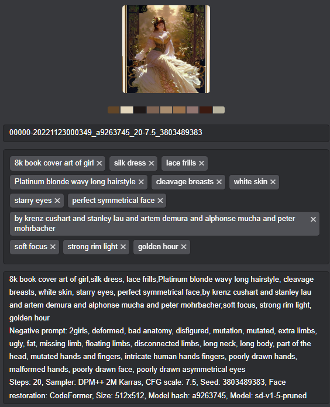

- This is Extension for [AUTOMATIC1111's Stable Diffusion Web UI](https://github.com/AUTOMATIC1111/stable-diffusion-webui)
- Send your creation image to [Eagle](https://jp.eagle.cool/) (image management software) with Generation info, tags.

## How to Install

- Go to `Extensions` tab on your web UI

- `Install from URL` with this repo URL

- Install

## How to use

- Enable this extension in "Setting"

- Open "Eagle" application

- Open "AUTO1111" and create image as usual.
  
   - images sent to "Eagle" automatically

## Setting sample

| Settings              | Result                | Comment                                                                                                           |
| --------------------- | --------------------- | ----------------------------------------------------------------------------------------------------------------- |
| 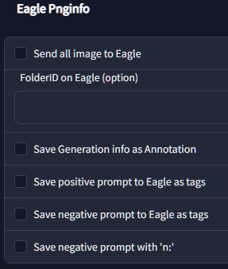   | No output to Eagle    |                                                                                                                   |
| 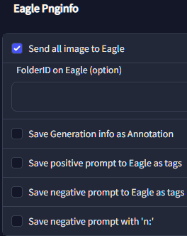 | 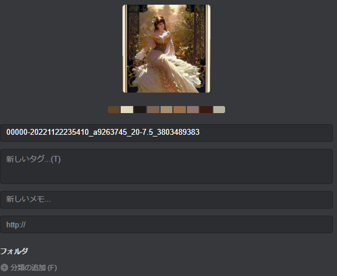 | Image sent to Eagle, only with filename.                                                                          |
| 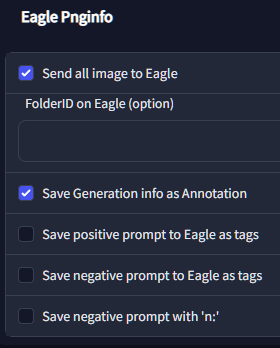 | 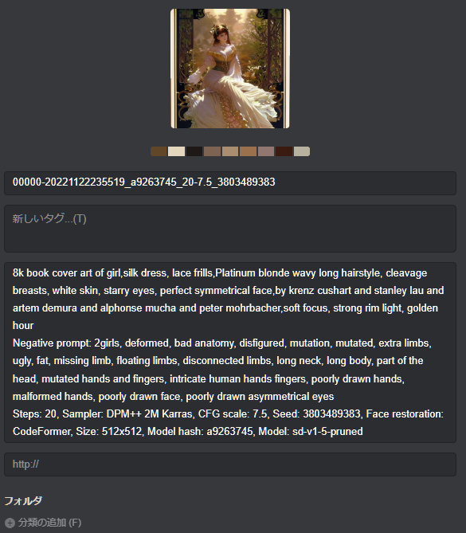 | Image sent to Eagle with Generation info.                                                                         |
| 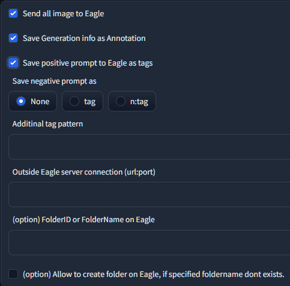 | 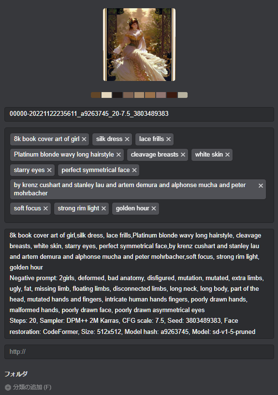 | Image set to Eagle, with Generation info, tags from positive prompt                                               |
| 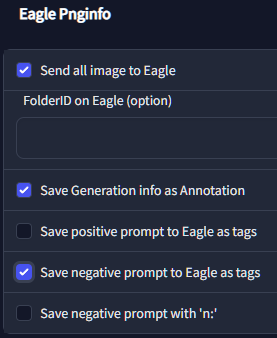 | 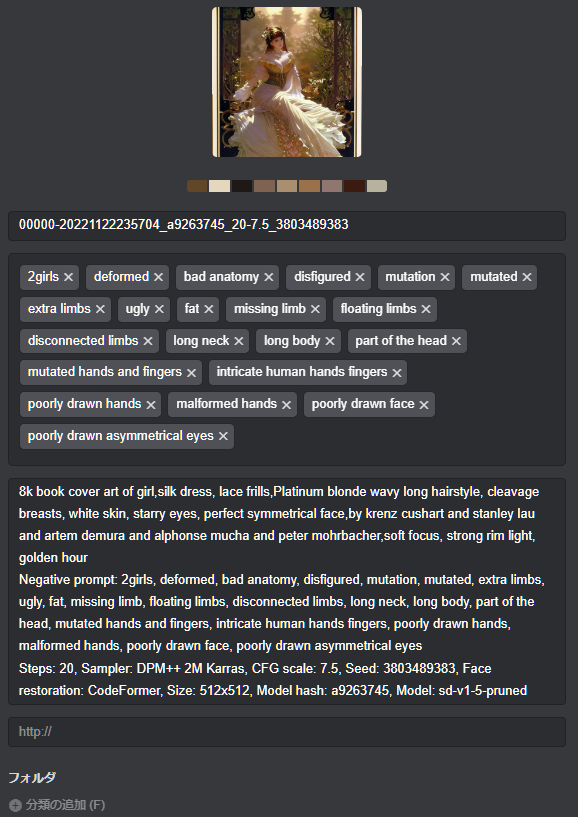 | Image set to Eagle, with Generation info, tags from negative prompt                                               |
| 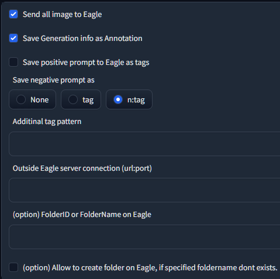 | 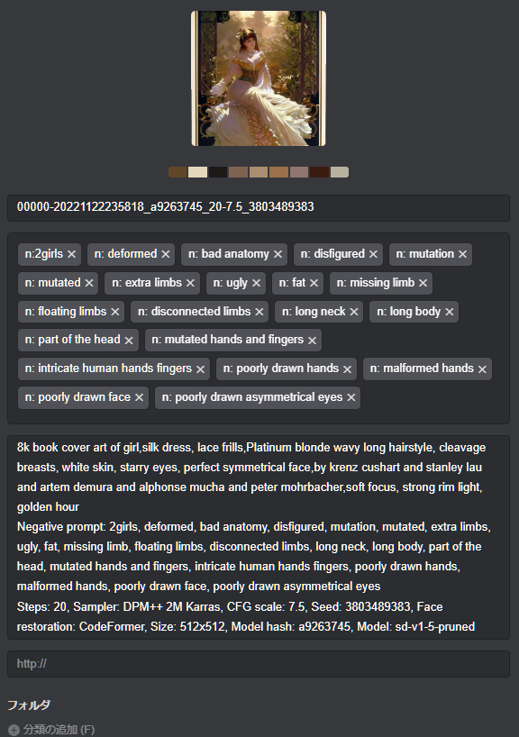 | Image set to Eagle, with Generation info, tags from negative prompt decorated with "n:".  i.e.) n:bad anatomy |
| 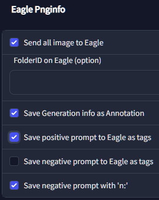 | 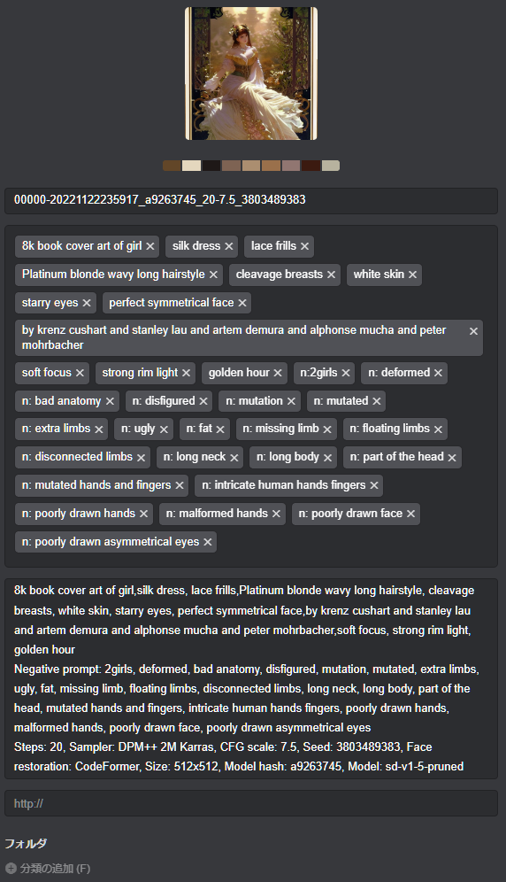 | Image set to Eagle, with Generation info, tags from positive prompt and negative prompt decorated with "n:".      |
|  | FolderID              | You can get "Eagle forlderID" on Eagle UI. Right click folder and select "copy link".                             |
| 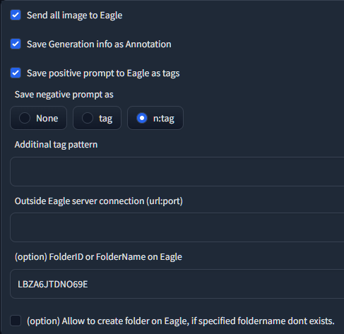 | 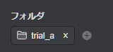 | Input folderID.                                                                                                   |
| 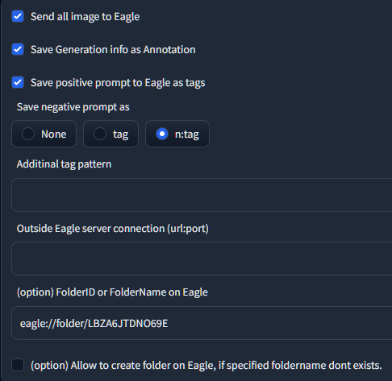 |                       | Bad sample. Only right-end value required.                                                                    |
